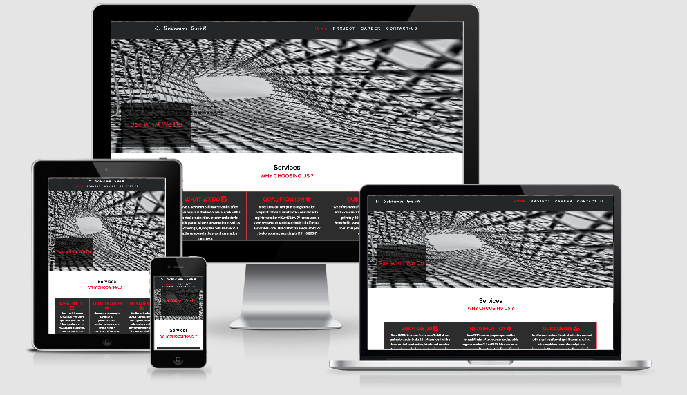

# Milestone Project 1: Schramm-Schlosserei-GmbH/ Metal-Construction Company

In this projected I created a fully functioning webpage for a metal working company called E.Schramm-Schlosserei-GmbH. The company has a very outdated and unfunctional current website [E-Schramm](https://www.schramm-schlosserei.de/index2.html) which will be replaced with this production. For the development I used HTML, CSS plus Bootstrap. The aim of this project was to improve the companies attraction by making it easy for current and future clients to find information, take contact and get an interactive impression of the companies service through an up to date homepage. As the company is located in Germany the legal-info and data privacy content is kept in German. The link to my project            
 [E-Schramm](https://laimo2020.github.io/MS1/)
 
 **Note: The company owner agrees that i uopdate this homepage, within the frame of My MS1.**

## UX

#### The purpose of the webpage is to promote the company. It addresses mainly future, but also current clients. The clients will be able to get a quick idea about the companies background and offers and take a look on already finished projects in a gallery. Users will be able to easily contact the company and find their directions through google maps. As the company is frequently employing new personal, a career page with option to apply directly, is included. 

## User Stories 

### As a private client or a public sector/ state sector the user will be able to :

- find information/history of the company
- see services provided by the company such as Metal-processing
- see finished projects in a gallery linked page.
- contact the company through a platform that is simple to use
- find the direction to the company smoothly through google maps.
- Get information about the legal background and the companies qualifications

### As a job seeker interested in the company the user will be able to  :

- See if there are current open positions in the team
- Submit an application and upload documents directly, using a form
- Get an impression of the companies work and team 
- Find contact information to communicate directly 

## Wireframes
#### For the creation of my wireframes I used the Balsamiqu program (see “technologies used). Throughout the development of the webpage the wireframes were very helpful for my self as well as in communication with the company owner. After an initial design idea I edited and changed the layout and reached a design which was well communicated and adapted to the wishes of the company as well as to my own knowledge about user experience and web development.

1. Mobile Wireframes

- [Home-page](https://github.com/LaiMo2020/MS1/blob/master/assets/images/wireframe/MS-1_Homepage-phone.png)

- [Legal-info](https://github.com/LaiMo2020/MS1/blob/master/assets/images/wireframe/MS-1_legalinfo-phone.png)

- [Contact](https://github.com/LaiMo2020/MS1/blob/master/assets/images/wireframe/MS-1_Contact-phone.png)
- [Gallery](https://github.com/LaiMo2020/MS1/blob/master/assets/images/wireframe/MS-1_project-phone.png)
- [Career](https://github.com/LaiMo2020/MS1/blob/master/assets/images/wireframe/MS-1_Career-phone.png)

2. Desktop Wireframes 

- [Home-page](https://github.com/LaiMo2020/MS1/blob/master/assets/images/wireframe/MS-1_Homepage.png)

- [Legal-info](https://github.com/LaiMo2020/MS1/blob/master/assets/images/wireframe/MS-1_Legal-info.png)

- [Contact](https://github.com/LaiMo2020/MS1/blob/master/assets/images/wireframe/MS-1_contact.png)

- [Gallery](https://github.com/LaiMo2020/MS1/blob/master/assets/images/wireframe/MS-1_Project.png)

- [Career](https://github.com/LaiMo2020/MS1/blob/master/assets/images/wireframe/MS-1_career.png)

## Features:

## 1. Header 

#### The header includes a Logo variation of the company that matches the pages modern design as well as a navbar with the most important menu sections. I implemented a fixed header that facilitates the users navigation and enables to go back to start easily after scrolling.

### The navbar includes links to:

### - Homepage

### - project/ gallery
#### Pictures in the gallery include a description text about projects that hovers when navigating through the page

### - Contact 
#### Includes a contact form allowing the user to send e-mails and project requests directly to the company. An embedded google maps with the companies location point facilitates the user to find directions to the companies office and workshop.

### - Career
#### Includes a text section with currently open positions as well as a form that allows job-seeker to upload their application documents and e-mail them directly to the company

## 2. Footer

#### The footer section includes all important information about the company and allows the user to dive deeper into the companies background and take further contact
 ### - Logo
#### The official companies Logo 

### - Legal-info & Data Privacy
#### Links to a page with collected legal information and information about data privacy rules. Those sections are crucial for a serious business page

### - social media 
#### Links to different social media channels

### - Contact info
#### Interactive icons to mail and call immediately while using the mobile page 

## Features to be developed in the future  

- Creating social media accounts, as the company does not have a presentation yet

- Including a “News” section that strengthens the users impression and warm feeling for the family owned business through updated news

## Technologies Used

### 1. [HTML](https://html.com/)

For the basic structure of the project

### 2. [CSS](http://css.com/)

For the styling and design of the webpage

### 3.  [Bootstrap](https://getbootstrap.com/)

Quick and responsive method to implement header, footer and others sections

### 4. [GitHub](https://github.com/)

Platform to publish the webpage and interact with clients and the coder community

### 5. [Gitpod](https://www.gitpod.io/)

A coding editor with an adapted and easy coding environment

### 6. [GIT](https://git-scm.com/)

For version control. As I changed my mentor during the project phase I created a new repository throughout the process. Many sections I had created during my tutoring with the first mentor were pasted into this new repository. Therefor e GIT was just used a few times. 

### 7. [Google Fonts](https://fonts.google.com/)

As a resource to design my fonts
### 8. [Font Awesome](https://fontawesome.com/6?next=%2F)

As a resource of icons to style my page
### 9. [ImageOptim](https://imageoptim.com/mac)

To minimise the file size of used photos in order to accelerate the pages loading time

### 10. [Chrome DevTools](https://developers.google.com/web/tools/chrome-devtools)

For live editing options while coding the page
### 11. [Balsamiq](https://balsamiq.com/)

To create wireframes

### 12. [Codpen](https://codepen.io/)

Inspiration from others developers

## Testing 

### Testing and review of the webpage

1. I have tested the webpage myself in the following browsers and devices:
- Google Chrome
- Firefox
- Safari
- Iphone XR
- MacBook Air

2. I have sent the webpage to family and friends who tested the page and responsiveness on following browser and devices:
- Google Chrome
- Firefox
- Safari
- iPad
- iPhone SE

### Validation of the code/ Screenshoot

- [vlaidator/screnshoot/HTML](https://github.com/LaiMo2020/MS1/blob/master/assets/images/validator/validator-html.png)

- [vlaidator/screnshoot/CSS](https://github.com/LaiMo2020/MS1/blob/master/assets/images/validator/vlaidator-css.png)

- [W3C/HTML](https://validator.w3.org/)
to check my  HTML code.

- [W3C/CSS](https://jigsaw.w3.org/css-validator/)
to check my CSS code.

- [Chrome DevTools](https://developers.google.com/web/tools/chrome-devtools)
to visualise/edit my code live.

### Issues identified and fixed during the testing phase
- Responsiveness of the header on iPad and IPhone SE. The issue got fixed through a change of the media tag from 767 to 768 px. Decreased font size for smaller devices
- The gallery box in the hero image wasn’t responsive in smaller devices. Fixed with a media tag

- The “attach-file” box in the career page was going over the header. Fixed with editing the  z-index tag

- Text on legal information was too small for small devices. Fixed by media tag through increasing the width to 90%

- there were many others issues, the lovely slack's community were there for an amazing support.

## Deployment:

### The following steps were taken for deployment of my site:

1. Creating my own account on github.com. My public profile can be accessed here: - [MS1/my project](https://laimo2020.github.io/MS1/
)
2. Login into gitpod.com using my GitHub account
3. Creating a project repository Used the template of Code Institute to facilitate the environment of the editor
4. Clicked on the gitpod green botton to accsses to my IDE on gitpod.
5. selected the Master branch GitHub pages section as source 
6. Using GIT to have different versions with a comment of my project **(Note: After changing my mentor I created a fresh repository and pasted the already finished parts from the first repository into it)**.  
7. GIT push leads me to the final URL of my projected that you can find in the settings and that can be shared with others to access the page in a browser

## Acknowledgement 
- My mentor Seun (Seun Owonikoko) for a great advices and support.
- The code institute community on slack for feedback on questions and helpful advices 
- Family members for help with testing and feedback on the page
- The company owner for a good communication and opportunity to design their new page

## References
 * *Code Institute course modules.
* https://codepen.io/
* https://getbootstrap.com/
* https://www.w3.org/
* https://getbootstrap.com/docs/4.5/getting-started/introduction/
* https://www.freeformatter.com/html-formatter.html#ad-output
* https://unsplash.com/
* http://ami.responsivedesign.is/#

